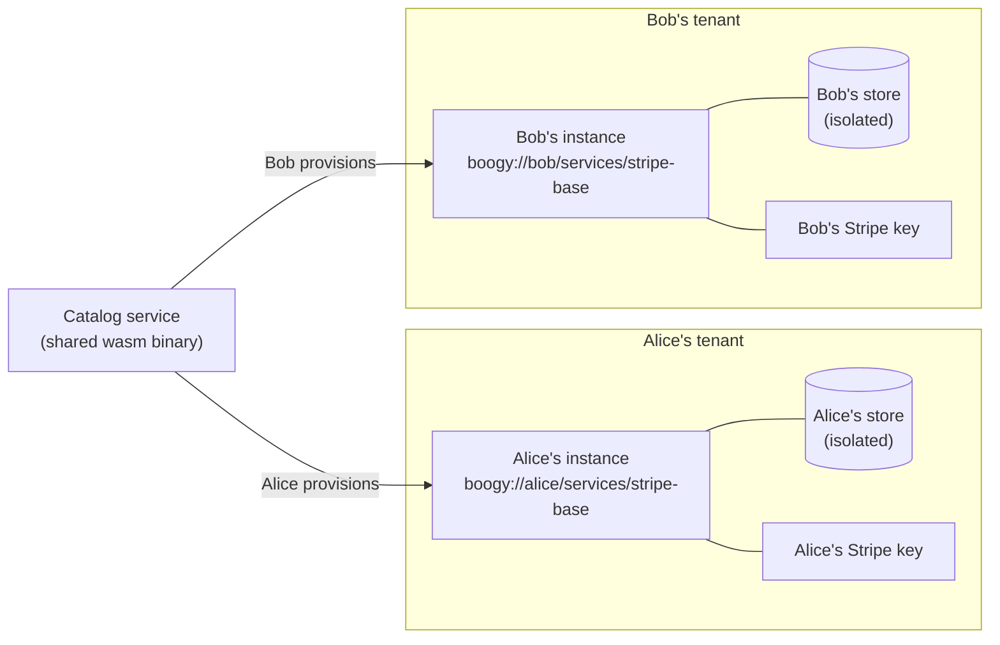
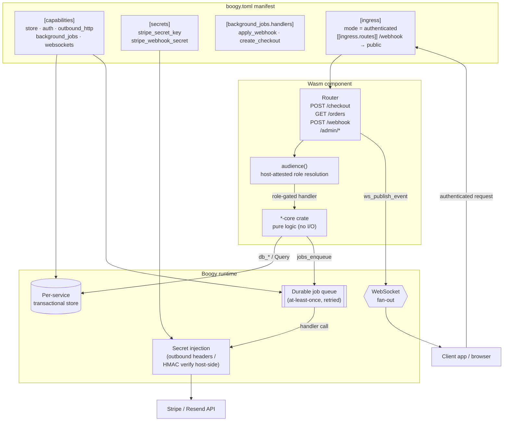

# Catalog architecture

This document explains the provisioning and isolation model for Boogy catalog
services, the anatomy of a single catalog service, and the BYO-key flow that
lets different tenants use the same wasm binary with their own credentials.

---

## The provisioning and isolation model

A catalog service is a wasm binary with no hardcoded owner. When a provisioner
deploys it, the Boogy runtime creates an isolated instance scoped entirely to
that provisioner's tenant. Every instance is independent: separate store, separate
secrets, separate configuration.



**Each provisioner gets:**
- Their own workload identity (`boogy://<owner>/services/<name>`)
- Their own isolated per-service transactional store — no data crosses tenant
  boundaries
- Their own bound secrets (API keys, signing secrets) stored KMS-wrapped; the
  runtime injects them at the wire edge, never exposing the value to the wasm

**Contrast with platform-operated services:** platform services are native Rust
compiled into the runtime binary, operate under a mesh-global identity
(`boogy://_sys/services/*`), and run as a single shared instance for the whole
platform. Catalog services are sandboxed wasm with per-tenant identity, isolation,
and data.

---

## Anatomy of a catalog service

Every catalog service has the same structure. The `boogy.toml` manifest is the
source of truth for what capabilities the service is allowed to use; the runtime
enforces this envelope and rejects any capability call not granted there.



Key points:

- **The manifest capability envelope is enforced at runtime.** A call to
  `outbound_http` is denied unless `[capabilities] outbound_http = true` is set
  and the target host is in `[outbound] allowed_hosts`. A wasm component cannot
  reach a host not listed in its manifest.
- **Secrets never reach the wasm.** Secrets are declared in the manifest, bound
  by the provisioner out-of-band, stored KMS-wrapped, and either injected as
  outbound HTTP headers by the host or verified host-side (HMAC). The wasm
  references a secret by name, not value.
- **Authorization is in-handler, host-attested.** The manifest ingress mode
  (`authenticated`, `public`) is the outer gate; the handler's `audience()`
  function resolves the caller's role from the attested identity on every request.
  No owner identity is hardcoded in the wasm, so the same binary is correct for
  every provisioner.
- **Durable jobs handle external calls.** Work that must survive a crash (calling
  Stripe, applying a webhook, executing a governance proposal's effects) is
  enqueued as a durable background job rather than executed inline. The job is
  retried until it succeeds or exhausts its attempt budget.

---

## The BYO-key flow

The provisioner's API keys never leave the platform's secret store. Here is how
a typical outbound call flows — using `stripe-base`'s checkout creation as an
example:

```mermaid
sequenceDiagram
    autonumber
    participant P as Provisioner
    participant CLI as boogy CLI
    participant Host as Boogy runtime
    participant Wasm as stripe-base wasm
    participant Stripe as api.stripe.com

    P->>CLI: boogy secrets bind stripe_secret_key sk_live_...
    CLI->>Host: PUT /_admin/secrets/alice/stripe-base/stripe_secret_key
    Note over Host: KMS wraps the secret; stored as ciphertext. Never logged.

    P->>Host: POST /alice/stripe-base/checkout {amount, currency, ...}
    Host->>Wasm: invoke handler (no secret in context)
    Wasm->>Wasm: insert queued order, enqueue create_checkout job
    Wasm-->>Host: 200 {order_id, status: "queued"}

    Host->>Wasm: create_checkout job fires
    Wasm->>Host: outbound_http::fetch {url: "https://api.stripe.com/...", secret_headers: [("Authorization", "stripe_secret_key")]}
    Note over Host: resolves "stripe_secret_key" → KMS-unwrap → inject as Authorization header
    Host->>Stripe: POST /v1/checkout/sessions (Authorization: Bearer sk_live_...)
    Stripe-->>Host: {id: "cs_...", url: "https://checkout.stripe.com/..."}
    Host-->>Wasm: response (no secret echoed back)
    Wasm->>Wasm: update order to pending with checkout URL
```

For webhook callbacks the flow is reversed — Stripe calls in anonymously, and
the host verifies the HMAC before the wasm sees the payload:

```mermaid
sequenceDiagram
    autonumber
    participant Stripe as Stripe
    participant Host as Boogy runtime
    participant Wasm as stripe-base wasm
    participant Jobs as Durable job queue

    Stripe->>Host: POST /alice/stripe-base/webhook<br/>{Stripe-Signature: t=...,v1=...}
    Note over Host: ingress route override: /webhook → public (no identity required)
    Host->>Wasm: invoke handler with raw body + signature header

    Wasm->>Host: secrets_verify_hmac_sha256("stripe_webhook_secret", signed_msg, expected_hex)
    Note over Host: KMS-unwrap stripe_webhook_secret, compute HMAC, constant-time compare
    Host-->>Wasm: Ok(true)  ← verified; Ok(false) or Err → 400, stop here

    Wasm->>Wasm: dedupe by Stripe event id (already seen → 200, no re-enqueue)
    Wasm->>Wasm: insert received WebhookEvent row
    Wasm->>Jobs: enqueue apply_webhook (idempotency-keyed on event id)
    Wasm-->>Host: 200 {status: "received", event_id: "evt_..."}

    Jobs->>Wasm: apply_webhook fires
    Wasm->>Wasm: resolve order by session id, update status to "paid"
    Wasm->>Host: ws_publish_event("orders", customer_ref, "order.status", ...)
```

The same outbound-header injection pattern applies to `resend-base`'s
`resend_api_key`. The same host-side HMAC-verify pattern can be applied to any
webhook that uses a shared secret for callback authentication.

---

## Transaction-safe external calls

Catalog services use an async-by-default pattern so outbound calls can participate
in cross-service transactions:

1. The handler inserts a record in a `queued` state and enqueues a durable job —
   both operations stage in the same transaction.
2. The job fires after the transaction commits and makes the external call.
3. If the external call fails transiently, the job retries until the attempt budget
   is exhausted.

This means a caller can wrap `POST /checkout` or `POST /send` inside a `tx` block:
if the outer transaction rolls back (due to any participant failure), the queued
record and the staged job both roll back too — the external call never fires.
If the transaction commits, the job fires exactly once per logical send/checkout.

---

## Further reading

- [boogy-sdk](https://github.com/Boogy-ai/boogy-sdk) — the SDK these services
  build against: `wit_glue!`, `Router`, `#[derive(Model)]`, `Query`, `McpServer`,
  and the `AGENTS.md` handler-authoring reference.
- [boogy-superpowers](https://github.com/Boogy-ai/boogy-superpowers) — agent
  skills for building Boogy services.
- [boogy.ai](https://boogy.ai) — platform documentation, deploy guide, and
  the `boogy` CLI reference.
