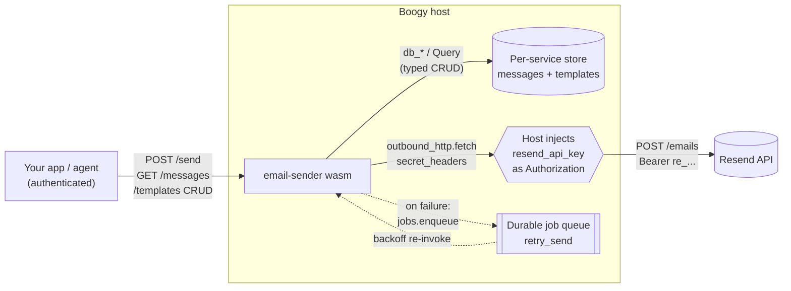
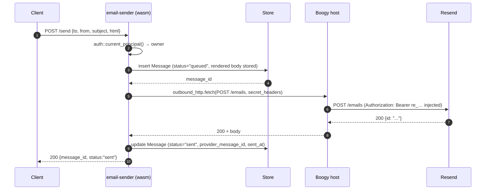
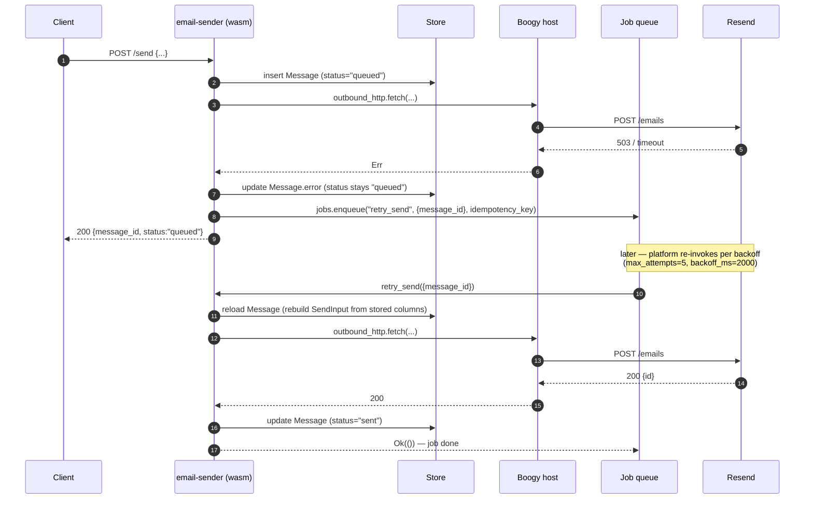
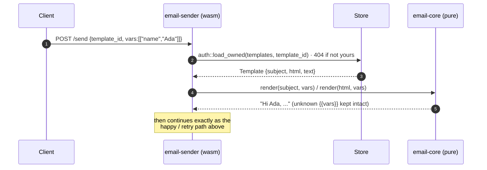
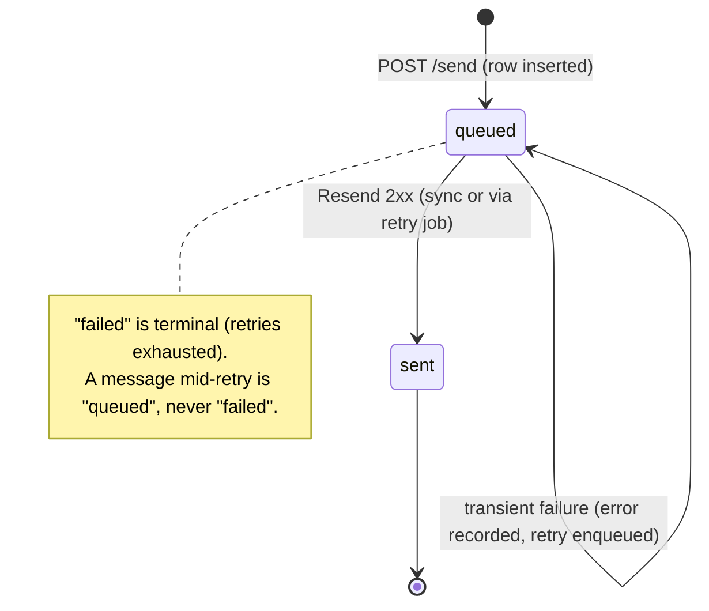

# email-sender

A **bring-your-own-key** transactional-email service for [Boogy](https://boogy.ai),
built as a thin, well-behaved wrapper around [Resend](https://resend.com).

You bind your own Resend API key (as a secret the service never reads), and the
service gives you:

- a `POST /send` endpoint that sends an email — inline, or rendered from a stored
  template with `{{variable}}` substitution,
- a **per-owner message log** you can list and inspect (`GET /messages`),
- reusable **email templates** with full CRUD (`/templates`),
- **automatic, durable retry** of transient send failures via a background job.

It is also a canonical example of how to write a production Boogy service:
typed `#[derive(Model)]` tables, principal-scoped reads, BYO-key secret
injection, durable background jobs, and pure host-testable logic split into a
sibling crate.

---

## Table of contents

- [Architecture at a glance](#architecture-at-a-glance)
- [Crate layout](#crate-layout)
- [Data model](#data-model)
- [The API — what you can do](#the-api--what-you-can-do)
- [How sending works (sequence diagrams)](#how-sending-works)
  - [Happy path](#happy-path-send-succeeds-first-try)
  - [Transient failure → durable retry](#transient-failure--durable-retry)
  - [Templated send](#templated-send)
- [The message lifecycle](#the-message-lifecycle)
- [Security model](#security-model)
- [Deploying it yourself](#deploying-it-yourself)
- [Worked examples](#worked-examples)

---

## Architecture at a glance



Key properties:

- **The Resend key lives in the host, never in the wasm.** The service declares a
  secret named `resend_api_key` and asks the host to inject it as the
  `Authorization` header on the outbound call. The wasm bytes never see the value.
- **Every read is owner-scoped.** A caller can only ever see their own messages
  and templates — missing rows and other people's rows both return `404`.
- **Sends are durable.** If Resend is briefly unavailable, the message is kept in
  a `queued` state and a background job retries it with backoff until it succeeds
  or the platform dead-letters it.
- **Pure logic is unit-tested off-wasm.** Template rendering and Resend
  request-body shaping live in [`email-core`](./email-core), a plain Rust library
  with its own tests.

---

## Crate layout

| Path | What it is |
|------|------------|
| [`src/lib.rs`](./src/lib.rs) | The service: router, HTTP handlers, the shared `resend_send` outbound call. |
| [`src/models.rs`](./src/models.rs) | The two `#[derive(Model)]` tables — `Message` and `Template`. |
| [`src/jobs.rs`](./src/jobs.rs) | The `retry_send` durable background-job handler. |
| [`email-core/`](./email-core) | **Pure, host-testable logic:** `render()` (`{{var}}` substitution) and `resend_body()` (JSON shaping). No wasm, no host — just unit tests. |
| [`boogy.toml`](./boogy.toml) | The deployment manifest: routing, capabilities, the secret declaration, the job config. |

The split between the `cdylib` wasm crate and the `email-core` `rlib` is
deliberate: `wit_bindgen::generate!` emits component-only symbols that don't
host-link, so anything you want to unit-test normally goes in `email-core`.

---

## Data model

Two tables, both defined as typed structs with `#[derive(Model)]`. The derive
generates the schema, the column-name constants, and the row round-trip, so
handlers go through the typed `db_*` / `Query` layer and never touch raw string
column names.

### `messages` — the send log

| Column | Type | Notes |
|--------|------|-------|
| `id` | `u64` (pk) | Store row id. |
| `owner_principal` | string *(indexed)* | Tenancy column — who sent it. |
| `to_addr` / `from_addr` | string | Recipient / sender. |
| `subject` | string | Final (rendered) subject. |
| `body_html` / `body_text` | optional string | The **rendered** body, stored so a retry can resend verbatim without re-rendering. |
| `template_id` | optional string | Set if the send used a stored template. |
| `provider_message_id` | optional string | Resend's id, populated once delivered. |
| `status` | string *(indexed)* | `queued` \| `sent` \| `failed`. |
| `error` | optional string | Last provider error (truncated, for observability). |
| `created_at` / `sent_at` | timestamps | epoch-millis. |

### `templates` — reusable layouts

| Column | Type | Notes |
|--------|------|-------|
| `id` | `u64` (pk) | Store row id. |
| `owner_principal` | string *(indexed)* | Tenancy column. |
| `name` | string | Human label. |
| `subject` / `html` | string | Renderable bodies — `{{var}}` placeholders are substituted at send time. |
| `text` | optional string | Optional plain-text alternative. |
| `created_at` / `updated_at` | timestamps | epoch-millis. |

---

## The API — what you can do

All routes require authentication (`[ingress] mode = "authenticated"`). The
caller's identity (a human/agent principal) becomes the `owner_principal` on
writes and the scope filter on reads. Every route is typed end-to-end, so the
service auto-serves an OpenAPI 3.0 document at `GET /openapi.json`.

### Send

| Method & path | Body | Returns |
|---------------|------|---------|
| `POST /send` | `SendReq` (below) | `{ message_id, status }` where `status` is `sent` or `queued`. |

`SendReq` — supply **either** an inline message **or** a `template_id`:

```jsonc
{
  "to":   "buyer@example.com",
  "from": "Acme <hello@acme.com>",   // must be a verified Resend sender

  // Option A — inline:
  "subject": "Welcome!",
  "html":    "<h1>Hi there</h1>",     // html and/or text required inline
  "text":    "Hi there",

  // Option B — render a stored template:
  "template_id": "12",
  "vars": [["name", "Ada"], ["code", "42"]]   // fills {{name}}, {{code}}
}
```

Validation: without a `template_id`, `subject` is required and at least one of
`html` / `text` must be present. With a `template_id`, the template's subject and
body are rendered with `vars` (unknown `{{placeholders}}` are left intact).

### Messages (read-only log)

| Method & path | Returns |
|---------------|---------|
| `GET /messages` | `{ items: [...], count }` — the caller's messages, **newest first**. |
| `GET /messages/{id}` | One message, or `404` if missing **or** not yours. |

The projection omits the stored body and the `owner_principal`; it exposes
`status`, `error`, `provider_message_id`, and timestamps so you can build a
delivery dashboard.

### Templates (CRUD)

| Method & path | Body | Returns |
|---------------|------|---------|
| `POST /templates` | `{ name, subject, html, text? }` | `201` + the created template. |
| `GET /templates` | — | `{ items, count }`, newest first. |
| `GET /templates/{id}` | — | One template, or `404` (missing/not-yours). |
| `DELETE /templates/{id}` | — | `204`. Guarded by `owns_resource`. |

---

## How sending works

### Happy path: send succeeds first try



Note the **queued-first** write: the row is inserted as `queued` *before* the
outbound call, so even if the host crashed mid-send there would be a durable
record. On success it flips to `sent`.

### Transient failure → durable retry



Why the message stays `queued` (not `failed`) while a retry is pending: `failed`
is **terminal** — it means retries were exhausted. A message mid-retry is still
`queued`, which keeps the row consistent with the `queued` response the caller
got and with the `status` index the message log filters on. (Returning
`Err(String)` from the job signals a *retryable* failure; `Ok(())` marks it
done.)

> **Why isn't this one transaction?** The insert (`queued`) and the later update
> (`sent`) straddle the external Resend call, and `outbound_http` is denied while
> a store transaction is open. So they are genuinely *independent writes*: the
> `queued` row is a durable, observable intermediate state that the retry job
> reconciles. This is the standard Boogy pattern for "write → external call →
> write", marked with an `// independent-writes:` comment in the source.

### Templated send



`render()` is single-pass — substituted values are never re-scanned, so a value
like `{{b}}` injected via `vars` is **not** itself expanded. That's a deliberate
injection guard, covered by a unit test in `email-core`.

---

## The message lifecycle



> **Known limitation:** when the platform finally dead-letters an exhausted
> retry job, the row is left `queued` rather than flipped to `failed`. A
> dead-letter reconciliation hook (sweep the DLQ → mark messages `failed`) is
> future work. Keeping it `queued` is honest; flipping to `failed` on every
> transient error was incoherent because the next successful retry would flip it
> back to `sent`.

---

## Security model

- **The API key is never in the wasm.** The manifest declares
  `[secrets] resend_api_key = { usage = ["outbound-header"] }`. On the outbound
  call the service passes `secret_headers: [("Authorization", "resend_api_key")]`;
  the host resolves the bound secret and injects its **verbatim** value as the
  `Authorization` header at the wire edge. Because the value is substituted
  outright, you bind the *full* header value (e.g. `Bearer re_...`) — the code
  adds no `Bearer ` prefix.
- **Outbound is allow-listed.** `[outbound] allowed_hosts = ["api.resend.com"]`
  is the only third party this service can reach; the host SSRF-firewalls
  everything else.
- **Tenant isolation by construction.** Reads use `auth::current_principal()` +
  an `owner_principal` filter (or `auth::load_owned` for single rows); the
  template delete sits behind an `auth::owns_resource` guard. Missing and
  not-owned both surface as `404`, so you can't probe for another tenant's ids.
- **Untrusted provider output is bounded.** A non-2xx Resend body is truncated to
  512 bytes (on a UTF-8 char boundary) before it can land in the `error` column.

---

## Deploying it yourself

1. **Build** the wasm component:

   ```bash
   cargo build -p email-sender --target wasm32-wasip2 --release
   ```

2. **Provision** it from `boogy.toml` (sets routing, capabilities, the secret
   declaration, the `retry_send` job). The manifest grants `store`, `auth`,
   `clock`, `entropy`, `outbound_http`, and `background_jobs`.

3. **Bind your Resend key** out-of-band via the admin secrets endpoint — bind the
   *full* `Authorization` value:

   ```bash
   # value is exactly what goes in the header:
   printf 'Bearer re_your_key_here' | \
     boogy secret set <owner>/email-sender/resend_api_key --stdin
   ```

4. **Send** — authenticate as the owner and call `POST /send`.

Manifest highlights:

```toml
[ingress]              # every route requires auth
mode = "authenticated"

[outbound]             # only Resend is reachable
allowed_hosts = ["api.resend.com"]

[secrets]              # BYO key, injected as a header, never read by wasm
resend_api_key = { usage = ["outbound-header"] }

[background_jobs.handlers.retry_send]
deadline_ms = 10000
max_attempts = 5
backoff_ms = 2000
```

---

## Worked examples

```bash
# 1. Create a template with {{variables}}
curl -X POST https://<host>/<owner>/templates \
  -H "authorization: Bearer <token>" -H 'content-type: application/json' \
  -d '{"name":"welcome","subject":"Welcome {{name}}!","html":"<h1>Hi {{name}}</h1>"}'
# → 201 {"id":12, ...}

# 2. Send using that template
curl -X POST https://<host>/<owner>/send \
  -H "authorization: Bearer <token>" -H 'content-type: application/json' \
  -d '{"to":"ada@example.com","from":"hello@acme.com","template_id":"12","vars":[["name","Ada"]]}'
# → 200 {"message_id":99,"status":"sent"}   (or "queued" on transient failure)

# 3. Inspect the delivery log
curl https://<host>/<owner>/messages \
  -H "authorization: Bearer <token>"
# → {"items":[{"id":99,"to_addr":"ada@example.com","status":"sent",...}],"count":1}
```

---

*Part of the [Boogy catalog](../README.md). See the SDK's `AGENTS.md` for the
canonical handler-authoring conventions these services follow.*
