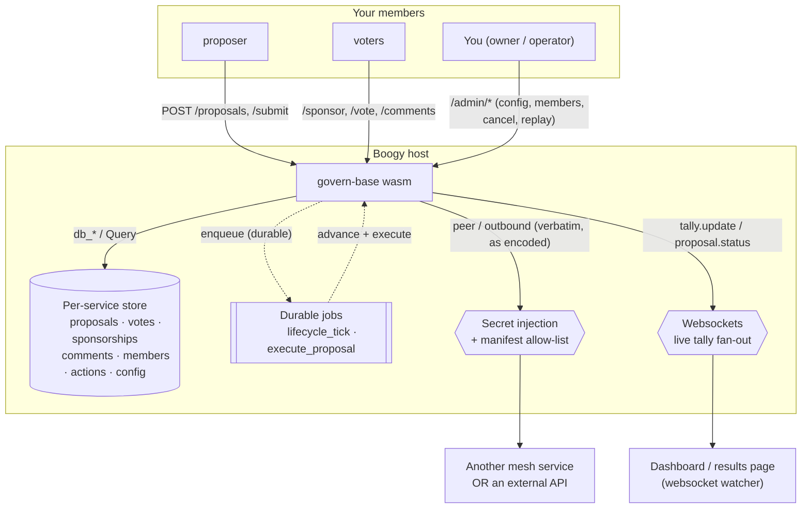
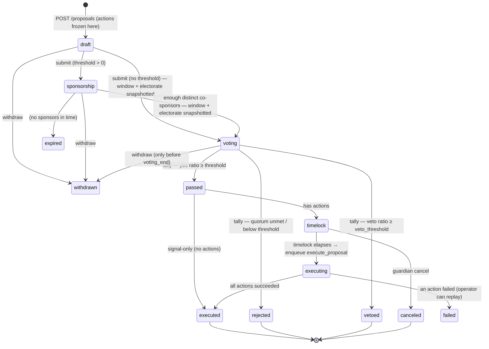
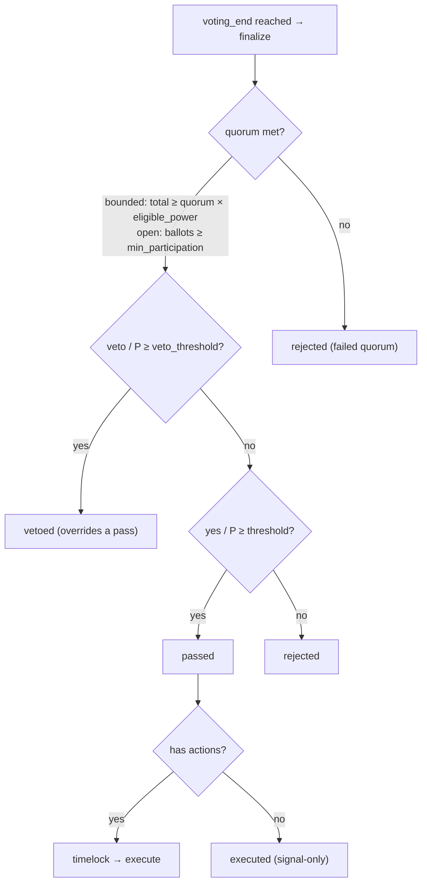
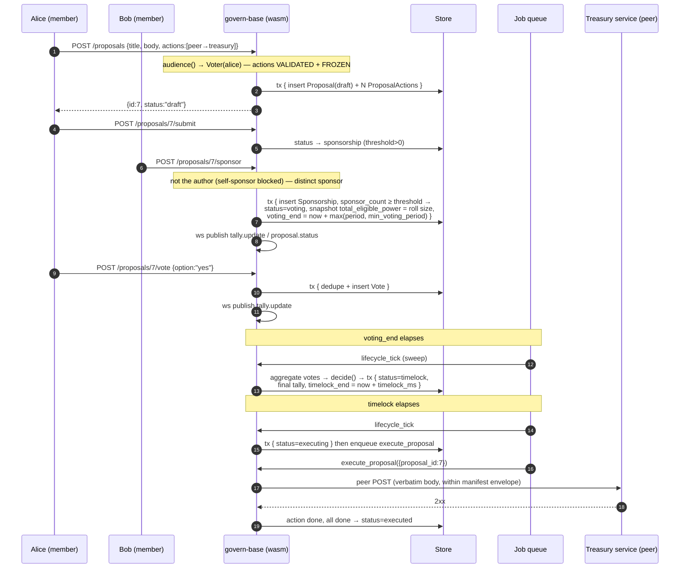
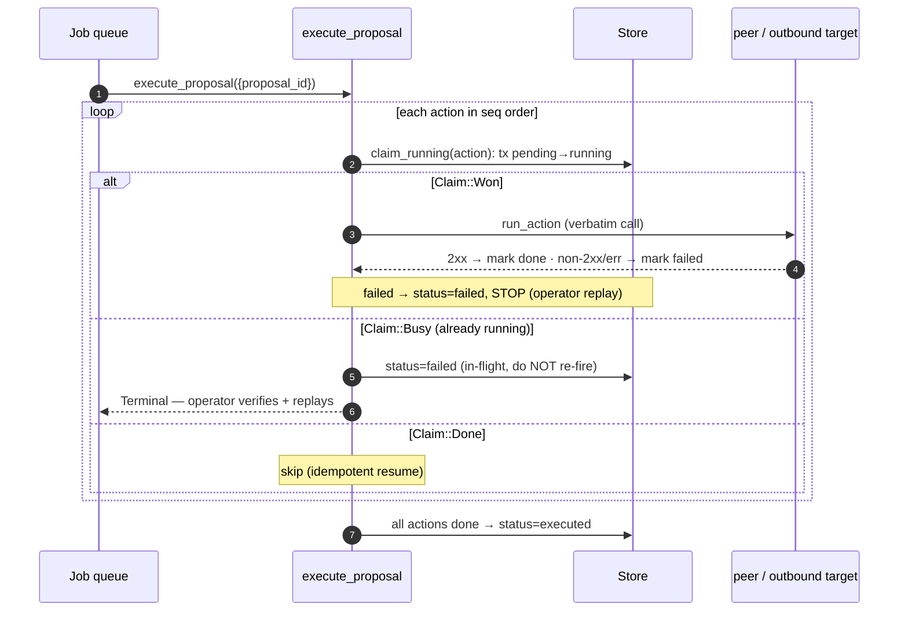
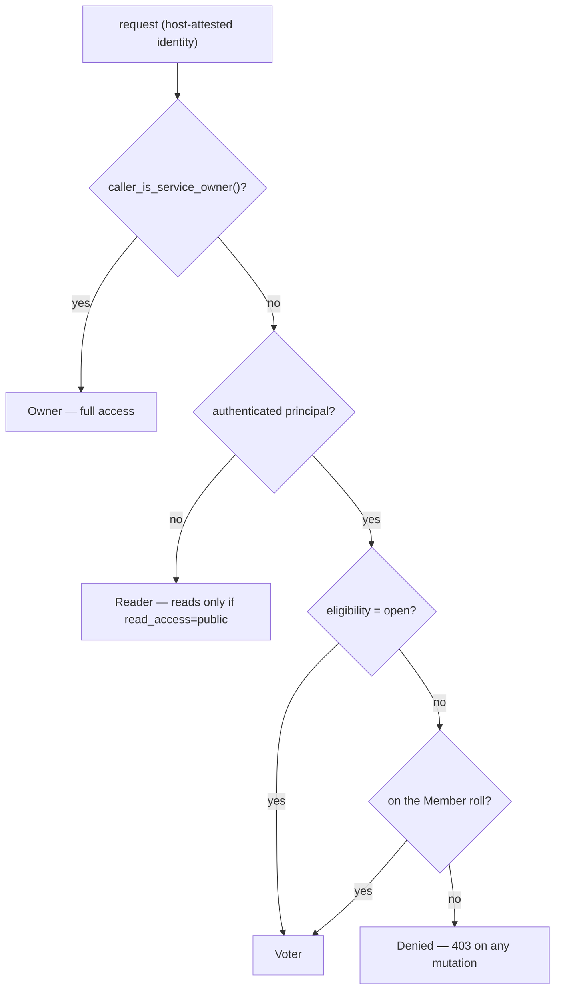

# govern-base

A **provisionable governance engine** for [Boogy](https://boogy.ai) — run real
decision-making for your community, DAO, cooperative, or app. Members **propose**,
gather **co-sponsors**, and **vote** (one member, one vote) with **quorum, a pass
threshold, and a veto gate**. A passed proposal can wait out a **timelock** and
then **execute real effects** — calling another service in your mesh or an outside
API — exactly as written in the proposal.

It distills what has empirically *worked* across on-chain (Cosmos, Compound) and
civic (Decidim, Estonia, participatory budgeting) governance, and deliberately
leaves out what hasn't (mandatory plutocratic token-weighting, futarchy,
gas-gated participation). You bring your own membership and policy; the module
brings the lifecycle, the tally math, the execution, and the **anti-gaming guards**.

It is also a canonical example of several Boogy patterns: **host-attested
in-handler authorization** (`authenticated` ingress with NO hardcoded owner — the
handler's `audience()` does the scoping), **durable effectful jobs** with
**exactly-once execution**, **service websockets** for live tallies, an **MCP**
surface for LLM clients, and pure host-tested decision logic in a sibling crate.

---

## Table of contents

- [The model (read this first)](#the-model)
- [Eligibility & Sybil resistance](#eligibility--sybil-resistance)
- [Architecture at a glance](#architecture-at-a-glance)
- [Crate layout](#crate-layout)
- [Data model](#data-model)
  - [`config`](#config--your-singleton-policy)
  - [`proposals`](#proposals--the-aggregate-root)
  - [`proposal_actions`](#proposal_actions--the-immutable-effects)
  - [`votes` · `sponsorships` · `comments`](#votes--sponsorships--comments)
  - [`members` · `admin_audit`](#members--admin_audit)
- [The proposal lifecycle](#the-proposal-lifecycle)
- [How a vote is decided (quorum / threshold / veto)](#how-a-vote-is-decided)
- [Sequence diagrams](#sequence-diagrams)
  - [End to end: propose → decide → execute](#end-to-end-propose--decide--execute)
  - [Exactly-once execution](#exactly-once-execution)
  - [Eligibility resolution (`audience()`)](#eligibility-resolution-audience)
- [The API — what you can do](#the-api--what-you-can-do)
  - [Request / response reference](#request--response-reference)
- [Transparent execution (the Boogy-native part)](#transparent-execution)
- [Anti-gaming & integrity model](#anti-gaming--integrity-model)
  - [Attack → defense matrix](#attack--defense-matrix)
- [Live tallies (websockets)](#live-tallies)
- [MCP surface](#mcp-surface)
- [Security model](#security-model)
- [Ingress posture](#ingress-posture)
- [Deploying it yourself](#deploying-it-yourself)
- [Worked example](#worked-example)
- [Design lineage & non-goals](#design-lineage--non-goals)

---

## The model

**One provisioned deployment = one governance space, owned by you (the provisioner).**
You deploy `govern-base` once, configure your policy once, and your members
propose / sponsor / vote / deliberate within it. Like the other catalog modules
it **hardcodes no owner** — authorization is resolved in every handler from the
host-attested identity, so the *same* wasm is correct for every provisioner.

There are three roles, resolved host-side per request:

| Role | Who | Can |
|------|-----|-----|
| **Owner** | you — the service owner (your agent, attested by `caller_is_service_owner`) | configure policy, manage the member roll, moderate, guardian-cancel, operate `/admin/*`, **and** participate as a voter |
| **Voter** | an eligible participant (see [Eligibility](#eligibility--sybil-resistance)) | propose, co-sponsor, vote, comment |
| **Reader** | anyone — but only when you open reads | read proposals, tallies, comments |

A **proposal** is the aggregate root; sponsorships, votes, comments, and the
executable actions all hang off it by `proposal_id`. Everything in a deployment
belongs to the single owner — there is no cross-owner data inside one space, so
authorization is purely role-based, never a cross-tenant filter.

---

## Eligibility & Sybil resistance

The single most important policy choice — and the heart of "can people game this?"
The headline threat to one-member-one-vote is a **Sybil attack**: one person
spinning up many identities to vote many times. You choose the electorate via
`Config.eligibility`:

| Mode | Who may vote | Sybil posture |
|------|--------------|---------------|
| `open` | any authenticated principal | **Permissionless by design** — inherently Sybil-vulnerable without an external proof-of-personhood layer. Use for low-stakes / public signalling. |
| `members` | only principals on your operator-managed **Member roll** | **Sybil-resistant** — votes are restricted to a curated electorate you control. |
| `workloads` | only attested workloads on the roll | mesh/service governance (services voting on a shared parameter). |

In `members`/`workloads` mode the roll is enforced in **every** mutation
(`propose`, `sponsor`, `vote`, `comment`) — a non-member is denied, host-attested,
in-handler. The electorate size is **snapshotted onto each proposal when voting
opens**, so quorum is measured against a fixed, known denominator and a mid-vote
roll change can't move the goalposts.

> **Recommendation:** for any decision that matters, use `members` (or `workloads`)
> and curate the roll. `open` is a deliberate "anyone can vote" mode and says so —
> `govern-base` will not pretend a permissionless space is Sybil-proof.

---

## Architecture at a glance



The flow: a proposal is **drafted** with its encoded actions, gathers **sponsors**,
opens for **voting**, is **tallied** (quorum / threshold / veto), and — if it passes
*with* actions — waits out a **timelock** then **executes** those actions verbatim.
A periodic `lifecycle_tick` job (plus lazy evaluation on read) advances proposals
whose windows have elapsed; `execute_proposal` runs the effects durably and
**exactly once**.

---

## Crate layout

| Path | What it is |
|------|------------|
| [`src/lib.rs`](./src/lib.rs) | Router + the `audience()` / `require_voter()` / `require_owner()` / `gate_read()` authorization spine + shared helpers. |
| [`src/proposals.rs`](./src/proposals.rs) | Create (with immutable actions, in one `tx`), read, list, submit, withdraw + the author cooldown + min-voting-period clamp. |
| [`src/sponsor.rs`](./src/sponsor.rs) | Co-sponsorship (self-sponsor blocked) + the sponsorship-threshold → voting transition + electorate snapshot. |
| [`src/voting.rs`](./src/voting.rs) | Cast a ballot (single-cast, in a `tx`), the tally endpoint, tally aggregation. |
| [`src/lifecycle.rs`](./src/lifecycle.rs) | Time-based advancement (voting→tally, timelock→execute), finalization, the `lifecycle_tick` sweep job. |
| [`src/execution.rs`](./src/execution.rs) | `execute_proposal` — runs a passed proposal's encoded actions **exactly once** (`claim_running`), per-action status, operator replay. |
| [`src/comments.rs`](./src/comments.rs) | Threaded deliberation + moderation. |
| [`src/admin.rs`](./src/admin.rs) | Operator surface: config, member roll CRUD, guardian-cancel, replay, moderation, audit log + the config loader / audit writer. |
| [`src/mcp.rs`](./src/mcp.rs) | MCP tools (`list_proposals`, `get_proposal`) for LLM clients. |
| [`src/ws.rs`](./src/ws.rs) | Best-effort websocket publish helpers for live tally + status. |
| [`src/models.rs`](./src/models.rs) | The eight `#[derive(Model)]` tables. |
| [`govern-base-core/`](./govern-base-core) | **Pure, host-tested logic:** vote/status enums, weighted tally aggregation, the quorum/threshold/veto decision rule, action-envelope validation. 14 unit tests. |
| [`boogy.toml`](./boogy.toml) | The manifest: ingress (+ public-read carve-outs), capabilities, outbound allow-list, websocket channel, the two job handlers, limits. |

---

## Data model

All tables are typed `#[derive(Model)]` structs — handlers go through the `db_*` /
`Query` layer and never touch raw column names. Every row belongs to your single
deployment (`owner_principal`). `#[index]` columns are equality-seek; `#[lookup_by]`
columns are unique point lookups; `list_by` / `ranked_by` back the keyset feeds.

### `config` — your singleton policy

One row per deployment, maintained by the owner via `PUT /admin/config`. Handlers
read it to resolve eligibility, read access, the tally gates, and the windows.

| Column | Type | Notes |
|--------|------|-------|
| `eligibility` | string | `open` \| `members` \| `workloads`. |
| `read_access` | string | `authenticated` (default) \| `public`. |
| `voting_strategy` | string | `one_principal_one_vote` (Phase 1). |
| `voting_period_ms` / `timelock_ms` | i64 | Default voting + timelock windows. |
| `min_voting_period_ms` | i64 | Floor on any voting window (anti flash-proposal). |
| `quorum` / `threshold` / `veto_threshold` | string | Tally fractions, e.g. `"0.4"`. Stored as decimal strings, parsed fail-soft. |
| `sponsorship_threshold` | i64 | Distinct co-sponsors required before voting opens (`0` = skip). |
| `min_participation` | i64 | Absolute ballot floor used as quorum in `open` mode. |
| `author_cooldown_ms` | i64 | Min gap between one author's proposals (`0` = disabled). |
| `guardian_principals` | string | Comma-separated principals allowed to cancel during timelock (empty → owner only). |
| `exempt_proposers` | string | Comma-separated trusted proposers (agents/services) whose proposals **skip co-sponsorship** and open for voting on submit, even when a threshold is set. The owner is always exempt implicitly. |
| `created_at` / `updated_at` | timestamps | |

### `proposals` — the aggregate root

| Column | Type | Notes |
|--------|------|-------|
| `id` | u64 (pk) | Store row id. |
| `owner_principal` | string *(indexed)* | The deployment owner. |
| `author` | string *(indexed)* | Who created it. Backs the `?author=` filter + the cooldown lookup. |
| `title` / `body` | string | |
| `kind` | string | `standard` (Phase 1). |
| `status` | string *(indexed)* | The lifecycle state (see below). Backs `?status=`. |
| `category` | string | Delegation-scope key (reserved for Phase 2). |
| `strategy` / `eligibility` | string | **Snapshotted** at creation. |
| `quorum` / `threshold` / `veto_threshold` | string | **Snapshotted** gates — a later config change never alters an open vote. |
| `total_eligible_power` | i64 | **Snapshotted at vote-open** in bounded modes (= roll size); `0` in `open`. The quorum denominator. |
| `min_participation` | i64 | Snapshotted open-mode floor. |
| `sponsor_count` / `sponsorship_threshold` | i64 | |
| `voting_start` / `voting_end` / `timelock_end` | i64 | Epoch-ms windows; `0` until set. |
| `final_yes` / `final_no` / `final_abstain` / `final_veto` / `final_ballots` | i64 | The final tally, written at finalization. |
| `created_at` / `updated_at` | timestamps | |

`status` is one of: `draft` · `sponsorship` · `voting` · `passed` · `rejected` ·
`vetoed` · `timelock` · `executing` · `executed` · `failed` · `expired` ·
`withdrawn` · `canceled`.

### `proposal_actions` — the immutable effects

The transparently-encoded calls a passed proposal executes. **Frozen once the
proposal leaves `draft`**: nothing ever rewrites the content fields after creation —
only the execution-tracking fields change.

| Column | Type | Notes |
|--------|------|-------|
| `id` | u64 (pk) | |
| `proposal_id` | i64 *(indexed)* | Parent proposal. |
| `seq` | i64 | Execution order. |
| `action_type` | string | `peer` \| `http`. |
| `target` | string | `boogy://owner/services/<name>` (peer) or an `http(s)` URL. |
| `method` | string | `GET` \| `POST` \| `PUT` \| `DELETE`. |
| `headers` | string | JSON object of header → value (never secrets). |
| `body` | string | Verbatim request body. |
| `secret_header_ref` | string | Operator-bound secret NAME injected as a header at the wire edge; `""` = none. |
| `exec_status` | string | `pending` → `running` → `done` \| `failed` \| `skipped`. |
| `exec_result` | string | Last execution detail. |
| `attempts` | i64 | Incremented on each claim. |
| `created_at` | timestamp | |

### `votes` · `sponsorships` · `comments`

| `votes` | one ballot per `(proposal_id, voter)` |
|---|---|
| `proposal_id` *(indexed)* · `voter` *(indexed)* | the ballot key; single-cast in Phase 1 (re-vote → 409) |
| `option` | `yes` \| `no` \| `abstain` \| `veto` |
| `weight` | resolved voting power (`1` under 1p1v) |
| `cast_at` / `updated_at` | timestamps |

| `sponsorships` | co-sponsor endorsements — the **non-monetary deposit** |
|---|---|
| `proposal_id` *(indexed)* · `principal` *(indexed)* | one per pair; `sponsorship_threshold` distinct rows open voting |

| `comments` | threaded deliberation |
|---|---|
| `proposal_id` *(indexed)* · `parent_id` | `parent_id = 0` is a top-level comment |
| `author` · `body` · `hidden` | `hidden` is owner moderation; hidden comments are omitted from listings |

### `members` · `admin_audit`

| `members` | the electorate roll (bounded modes) |
|---|---|
| `principal` *(lookup_by)* | a human/agent principal **or** a workload URI |
| `weight` | per-member power (reserved for Phase 2 weighted voting; `1` today) |
| `role` · `added_at` | |

| `admin_audit` | append-only operator action log |
|---|---|
| `actor` · `action` · `target` · `detail` · `at` | one row per operator mutation (config update, member add/remove, cancel, replay, hide) |

---

## The proposal lifecycle



Transitions are **guarded and idempotent**: voting only happens while
`status == voting` and before `voting_end`; finalization re-checks `status` inside
the `tx`, so a double-sweep is a no-op; execution only proceeds from `timelock`.
Time-based transitions are driven by a periodic `lifecycle_tick` sweep **and**
lazily on read (`GET /proposals/{id}` advances a due proposal), so a tally is never
stale when observed.

---

## How a vote is decided

The tally is **Cosmos-aligned** and lives in the pure, unit-tested core
(`govern-base-core`). With participating power `P = yes + no + veto` (abstain is
excluded from the ratios):



- **Quorum** — bounded electorate (`members`/`workloads`): `(yes+no+veto+abstain) ≥
  quorum × total_eligible_power` (the snapshot). Abstain **counts toward quorum**
  but not the ratios. *Open* electorate has no fixed denominator, so quorum is an
  absolute floor: `ballot_count ≥ min_participation`.
- **Veto** — `veto / P ≥ veto_threshold` → **vetoed**, overriding a would-be pass
  (the guard against malicious-but-popular proposals).
- **Threshold** — `yes / P ≥ threshold` → **passed**; otherwise **rejected**.

Defaults: quorum `0.4`, threshold `0.5`, veto `0.334`. All comparisons are `≥`
(at-threshold passes), and division-by-zero is guarded (no participation → rejected).

---

## Sequence diagrams

### End to end: propose → decide → execute



### Exactly-once execution

The crux of "voters get what they approved, **once**." Each action is claimed
`pending → running` in a transaction *before* the call; a re-delivery that finds an
action already `running` refuses to re-fire and flags the proposal for the operator.



`replay` (operator) re-drives a `failed` proposal and, only with an explicit
`reset=true`, resets an interrupted `running` action back to `pending` (the operator
acknowledging they verified the side effect). It uses a stable key so two replays
can't run concurrently.

### Eligibility resolution (`audience()`)



---

## The API — what you can do

The service auto-serves an OpenAPI 3.0 document at `GET /openapi.json`.

### Participant routes (an eligible Voter; reads gated per [Ingress](#ingress-posture))

| Method & path | Does |
|---------------|------|
| `POST /proposals` | Create a draft proposal + its immutable encoded actions (one `tx`). Subject to author cooldown. |
| `GET /proposals` · `GET /proposals/{id}` | List (keyset-paginated, `?status=`/`?author=`, `?limit=`/`?cursor=`) / read one (lazily advances status). |
| `POST /proposals/{id}/submit` | Open co-sponsorship — or voting directly when no threshold is set **or the author is an exempt proposer** (owner / `exempt_proposers`). Author/owner. |
| `POST /proposals/{id}/withdraw` | Withdraw before `voting_end`. Author/owner. |
| `POST /proposals/{id}/sponsor` | Endorse a proposal in sponsorship; enough distinct sponsors opens voting. Author can't self-sponsor. |
| `POST /proposals/{id}/vote` | Cast `{"option":"yes"\|"no"\|"abstain"\|"veto"}`. Single-cast (re-vote → `409`). |
| `GET /proposals/{id}/tally` | The live aggregated tally. |
| `POST /proposals/{id}/comments` · `GET …/comments` | Threaded deliberation (keyset-paginated, oldest first, hidden omitted). |

### Operator routes (`/admin/*` — owner only)

| Method & path | Does |
|---------------|------|
| `GET` / `PUT /admin/config` | Read / update policy. |
| `POST` / `GET /admin/members` · `DELETE /admin/members/{principal}` | Manage the electorate roll (DELETE returns `204`). |
| `POST /admin/proposals/{id}/cancel` | **Guardian** (owner or a `guardian_principals` member): cancel a passed proposal during its timelock. |
| `POST /admin/proposals/{id}/replay-execution?reset=…` | Re-drive a `failed` proposal's actions. |
| `POST /admin/comments/{id}/hide` | Moderate a comment. |
| `GET /admin/audit` | The operator audit log (`?action=` filter, keyset-paginated). |

### Request / response reference

**`POST /proposals`** — create a proposal with one or more encoded actions:

```jsonc
{
  "title": "Fund the docs grant",
  "body": "Pay 500 to the docs team.",
  "category": "treasury",                 // optional (reserved for delegation scope)
  "actions": [                            // optional; omit for a signal-only proposal
    {
      "action_type": "peer",              // "peer" | "http"
      "method": "POST",                   // GET | POST | PUT | DELETE
      "target": "boogy://acme/services/treasury",  // peer URI or http(s) URL
      "headers": { "x-trace": "gov-7" },  // optional, never secrets
      "body": "{\"amount\":500,\"to\":\"docs\"}",  // verbatim
      "secret_header_ref": null           // optional operator-bound secret name
    }
  ]
}
// → { "id": 7, "status": "draft" }
```

**`POST /proposals/{id}/vote`** → `{ "proposal_id": 7, "option": "yes" }`
**`GET /proposals/{id}/tally`** → `{ "yes": 3, "no": 1, "abstain": 0, "veto": 0, "ballots": 4 }`

**`PUT /admin/config`** — every field optional; only the ones you send change:

```jsonc
{
  "eligibility": "members",
  "read_access": "authenticated",
  "voting_period_ms": 604800000,
  "timelock_ms": 86400000,
  "min_voting_period_ms": 3600000,
  "quorum": "0.4", "threshold": "0.5", "veto_threshold": "0.334",
  "sponsorship_threshold": 1,
  "min_participation": 1,
  "author_cooldown_ms": 0,
  "guardian_principals": "agent_018f...bob",
  "exempt_proposers": "boogy://acme/services/council"
}
```

---

## Transparent execution

A passed proposal can **do things** — the Boogy-native differentiator.

The legitimacy principle is on-chain-style **transparency**: voters approve the
**exact** encoded call, and that exact call is what executes — **immutable** from
creation through execution. An action is either:

- `peer` — an in-mesh `peer::fetch` to `boogy://<owner>/services/<name>`, or
- `http` — an `outbound_http` call to an external URL.

…and it runs **verbatim** (method, target, headers, body) after the timelock. The
**safety floor is the host's manifest envelope**: an `http` action can only reach a
host in your `[outbound] allowed_hosts`, and peer hops have identity-bearing headers
stripped by the host. So "arbitrary" means *arbitrary within the capability envelope
you declared at provision time, byte-bound to what voters approved.* An action may
name an operator-bound secret (`secret_header_ref`) so an authenticated outbound call
needs no secret in the proposal body.

**Exactly-once.** `execute_proposal` claims each action `pending → running` in a
transaction *before* the call (`claim_running`); under at-least-once job re-delivery
or a crash mid-action it will **not** silently re-fire — it stops and flags the
proposal `failed` for the operator. A `ProposalAction`'s content fields are **never**
written after creation; only `exec_status` / `exec_result` / `attempts` change.

---

## Anti-gaming & integrity model

Governance is only as good as its resistance to manipulation. The full guard set:

- **Sybil resistance** via the curated electorate (`members`/`workloads`), enforced
  on every mutation; `open` mode is honestly labeled permissionless.
- **Anti-spam to propose** — **co-sponsorship**: `sponsorship_threshold` distinct
  endorsers before voting opens (a non-monetary on-chain-deposit equivalent), with
  **self-sponsorship blocked**. The owner and any `exempt_proposers` you designate
  (trusted agents/services) are a deliberate fast-track — their proposals open for
  voting immediately, bypassing the gate. Designate sparingly; an exempt party can
  put a proposal to a vote without endorsement.
- **Per-author proposal cooldown** (`author_cooldown_ms`) — rate-limits agenda-flooding.
- **Anti flash-proposal** — `min_voting_period_ms` floors every voting window;
  finalization never fires before `voting_end`.
- **The veto gate** — `veto` power above `veto_threshold` overrides a popular-but-
  malicious proposal.
- **Timelock + guardian** — a passed proposal waits before executing; a guardian
  (owner or `guardian_principals`) can cancel it during the window.
- **Snapshotted electorate + single-cast** — the quorum denominator is fixed at
  vote-open so it can't be moved mid-vote; a voter casts once.
- **Immutable, transparent actions + exactly-once execution** — voters get what they
  approved, once.
- **Deny-by-existence reads + owner-only `/admin`** — host-attested, no hardcoded
  identity.

### Attack → defense matrix

| Attack | Defense |
|--------|---------|
| Spin up many identities to vote many times (Sybil) | `members`/`workloads` curated roll, enforced on every mutation. (`open` is opt-in permissionless.) |
| Vote twice from one identity | Single-cast per `(proposal, voter)` → `409`. |
| Spam the agenda with proposals | Co-sponsorship gate + per-author cooldown. |
| Pass your own proposal's spam gate | Self-sponsorship blocked. |
| Slip a proposal through before anyone notices (flash) | `min_voting_period_ms` floor; no finalize before `voting_end`. |
| Pass a malicious-but-popular proposal | Veto gate overrides a pass. |
| Change the action between approval and execution | Actions immutable post-`draft`; executed verbatim. |
| Make a passed effect fire twice | `claim_running` + stop-on-`running`; replay is operator-gated. |
| Move the quorum bar mid-vote (add/remove members) | `total_eligible_power` snapshotted at vote-open. |
| Reach beyond approved targets at execution | Manifest `[outbound] allowed_hosts` + peer capability cap the blast radius. |
| Read/operate another deployment's space | One owner per deployment; `/admin` owner-only; reads deny-by-existence. |

What `govern-base` does **not** claim: in `open` mode it cannot defeat a determined
Sybil — no permissionless system can without external identity. Choose `members`
when integrity matters.

---

## Live tallies

A `proposals` websocket channel (public, with a small replay buffer) pushes a
`tally.update` envelope on every committed vote and a `proposal.status` envelope on
every transition — keyed by proposal id. Watchers (a dashboard, a results page) get
real-time tallies; a reconnecting client catches up from the replay buffer or a
`GET /proposals/{id}/tally`. Publishes are best-effort and never block a vote or
sit inside a `tx`.

---

## MCP surface

LLM clients can read governance through the same auth path: an MCP mount at `/mcp`
exposes `list_proposals` and `get_proposal` tools (typed args + results, schemas
auto-derived). Useful for "summarize the open proposals" or "what's the tally on
proposal 12" agent workflows. Reads honor the same `read_access` gate.

---

## Security model

- **No hardcoded owner.** Ingress is plain `authenticated`; every handler resolves
  the caller's role from the **attested** identity via `audience()`. Correct for
  *every* provisioner — nothing to replace at deploy time.
- **`/admin/*` is owner-only** (`caller_is_service_owner`, host-attested);
  guardian-cancel additionally admits configured guardian principals.
- **Eligibility is enforced in-handler** in bounded modes — a non-member can't
  propose, sponsor, vote, or comment (via `require_voter()`).
- **Execution is bounded by the manifest** — `[outbound] allowed_hosts` + the peer
  capability cap the blast radius; secrets are injected host-side and never appear
  in a proposal.
- **Reads deny by existence** and are gated by `Config.read_access` (anonymous only
  when you set `public`).
- **Transactional integrity** — multi-step mutations (proposal+actions, sponsor+
  transition, vote dedupe+insert, finalize, config upsert) are each one `tx`, so a
  mid-handler error rolls the whole thing back; effectful calls + job enqueues stay
  outside any open `tx`.

---

## Ingress posture

The manifest default is `mode = "authenticated"` for all **mutations** (no owner
hardcoded). **Read** routes are carved out to `public` so a public deployment can
expose results anonymously — but the handler still enforces `Config.read_access`, so
anonymous reads succeed **only** when you've set `read_access = "public"`. This keeps
the public/private decision in your runtime config, not baked into the manifest.

```toml
[ingress]
mode = "authenticated"

[[ingress.routes]]
path = "/proposals"
mode = "public"
# … and /proposals/{id}, /proposals/{id}/tally, /proposals/{id}/comments
```

| Caller | `audience()` | On a mutation |
|--------|-------------|---------------|
| You (your agent, `caller_is_service_owner`) | `Owner` | full operator + participant access |
| An eligible member (`open`, or on the roll) | `Voter` | propose / sponsor / vote / comment |
| A non-member in a bounded mode | `Denied` | `403` |
| Anonymous | `Reader` | reads per `read_access`; `403`/`401` on mutations |

---

## Deploying it yourself

1. **Build** the wasm component:

   ```bash
   cargo build -p govern-base --target wasm32-wasip2 --release
   ```

2. **Provision** from `boogy.toml`. **Set `[outbound] allowed_hosts`** to the
   external hosts your proposals are allowed to call (this is your execution
   blast-radius floor — the placeholder must be replaced), and keep the capabilities
   (`store`, `auth`, `clock`, `entropy`, `peer`, `outbound_http`, `background_jobs`,
   `websockets`). The owner is your deploying principal.

3. **Configure your policy** via `PUT /admin/config` — choose `eligibility`
   (`members` for Sybil resistance), the quorum/threshold/veto gates, the voting and
   timelock windows, the sponsorship threshold, `min_voting_period_ms`,
   `author_cooldown_ms`, and any `guardian_principals`.

4. **Curate the roll** (bounded modes) via `POST /admin/members`.

5. **(Optional) Bind a secret** if your proposals make authenticated outbound calls,
   and reference it from an action's `secret_header_ref`.

---

## Worked example

```bash
# 1. Configure: a member-gated space, short windows for the demo
curl -X PUT https://<handle>.<base>/<service>/admin/config \
  -H "authorization: Bearer <owner-token>" -H 'content-type: application/json' \
  -d '{"eligibility":"members","sponsorship_threshold":1,"quorum":"0.4",
       "threshold":"0.5","veto_threshold":"0.334","min_voting_period_ms":3600000}'

# 2. Add members to the roll
curl -X POST https://<handle>.<base>/<service>/admin/members \
  -H "authorization: Bearer <owner-token>" -H 'content-type: application/json' \
  -d '{"principal":"agent_018f...alice"}'
# (repeat for bob; → {"principal":"agent_...","weight":1,"role":""})

# 3. Alice creates a proposal that, if passed, calls the treasury service
curl -X POST https://<handle>.<base>/<service>/proposals \
  -H "authorization: Bearer <alice-token>" -H 'content-type: application/json' \
  -d '{"title":"Fund the docs grant","body":"Pay 500 to the docs team.",
       "actions":[{"action_type":"peer","method":"POST",
                   "target":"boogy://<owner>/services/treasury",
                   "body":"{\"amount\":500,\"to\":\"docs\"}"}]}'
# → {"id":7,"status":"draft"}

# 4. Open it; Bob co-sponsors → voting opens (electorate snapshotted)
curl -X POST https://<handle>.<base>/<service>/proposals/7/submit  -H "authorization: Bearer <alice-token>"
curl -X POST https://<handle>.<base>/<service>/proposals/7/sponsor -H "authorization: Bearer <bob-token>"

# 5. Members vote
curl -X POST https://<handle>.<base>/<service>/proposals/7/vote \
  -H "authorization: Bearer <alice-token>" -H 'content-type: application/json' -d '{"option":"yes"}'
curl -X POST https://<handle>.<base>/<service>/proposals/7/vote \
  -H "authorization: Bearer <bob-token>"   -H 'content-type: application/json' -d '{"option":"yes"}'

# 6. Watch the tally live (optional) or poll it
curl "https://<handle>.<base>/<service>/proposals/7/tally" -H "authorization: Bearer <alice-token>"
# → {"yes":2,"no":0,"abstain":0,"veto":0,"ballots":2}

# 7. After voting_end the tally finalizes; if it passes with actions it enters
#    timelock, then execute_proposal calls the treasury service — exactly once,
#    exactly as encoded in the proposal.
curl "https://<handle>.<base>/<service>/proposals/7" -H "authorization: Bearer <alice-token>"
# → {"id":7,"status":"executed", ... "final_yes":2, "final_ballots":2, ...}
```

---

## Design lineage & non-goals

**Kept (empirically proven):** deposit-to-propose as non-monetary co-sponsorship
(Decidim) · quorum + threshold + `NoWithVeto` veto with abstain semantics (Cosmos) ·
timelock + guardian cancel (Compound / OZ Governor) · one-person-one-vote by attested
identity (Estonia / Decidim / Optimism Citizens' House) · decoupled signal-vs-execute
(Snapshot).

**Left out (empirically weak):** mandatory plutocratic token-weighting (plutocracy,
low turnout, vote-buying) · futarchy · gas-gated participation.

**Phase 1 (this module):** 1p1v, single-cast ballots, the full lifecycle + execution
+ anti-gaming. **Not yet built (own follow-on plans):** delegation / liquid democracy,
weighted voting, participatory budgeting, re-votable ballots, and Pol.is-style
consensus clustering.

---

*Part of the [Boogy catalog](../README.md). See the SDK's `AGENTS.md` for the
handler-authoring conventions these services follow.*
