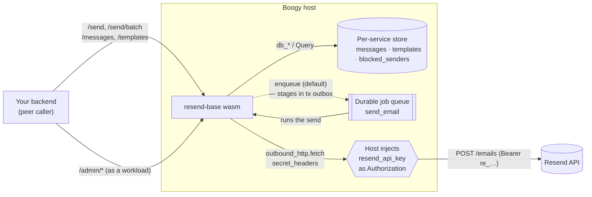
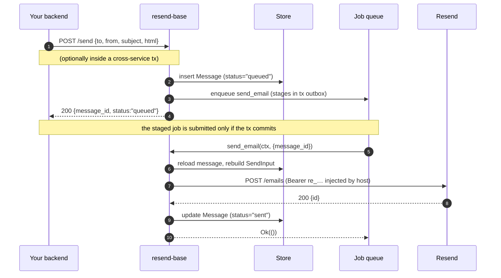
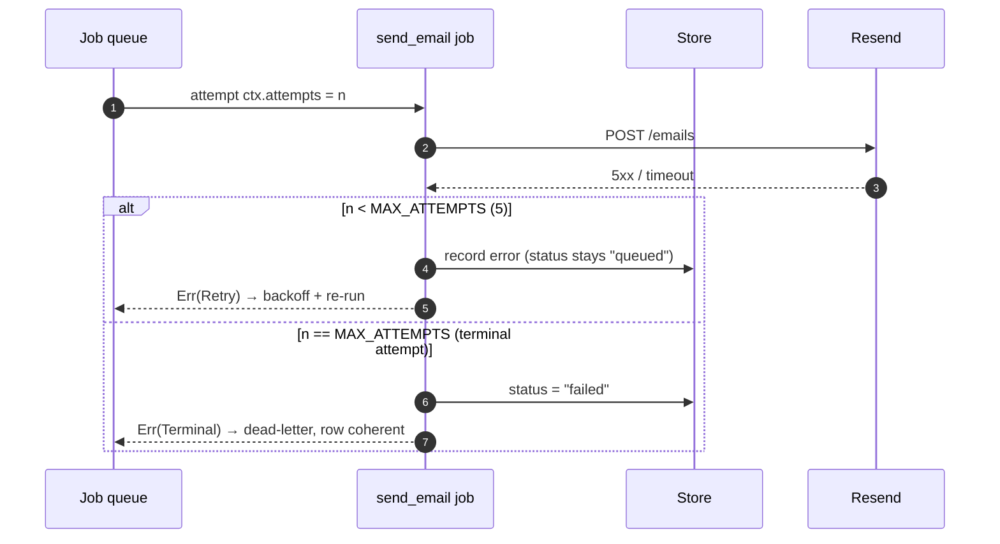
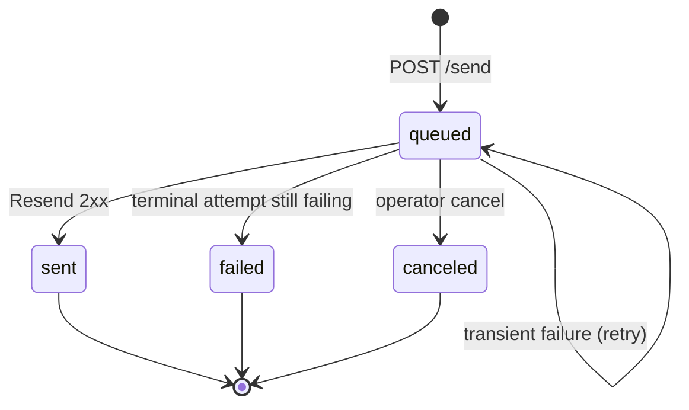
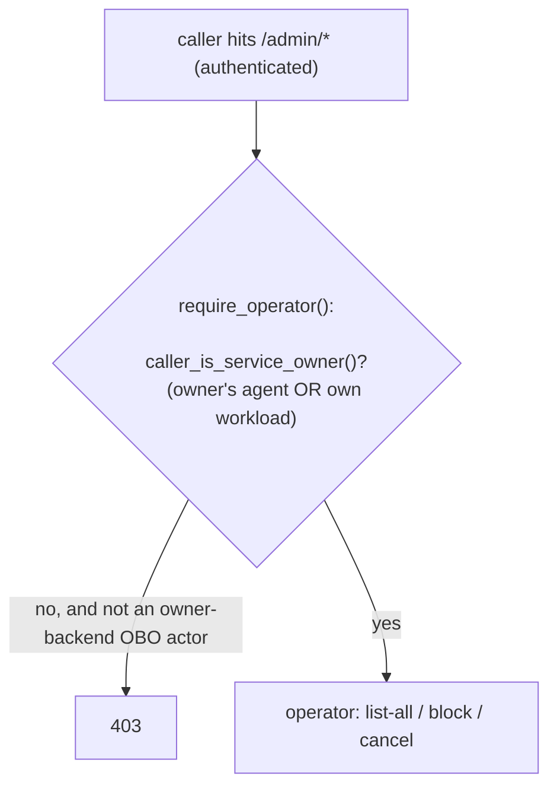

# resend-base

A **bring-your-own-key** transactional-email service for [Boogy](https://boogy.ai),
built as a thin, well-behaved wrapper around [Resend](https://resend.com).

You bind your own Resend API key (as a secret the service never reads), and your
app's backend calls this module to:

- **send email** — inline, or rendered from a stored template with `{{ variable }}`
  substitution — **as a durable job by default**, so a send can be part of a
  transaction (it goes out only if your transaction commits);
- **send a batch** to many recipients in one call;
- keep a **per-sender message log** (`/messages`);
- manage reusable **templates** (`/templates`);
- and give the **app admin** an operator surface to list/filter *everyone's*
  mail and **block a sender** (`/admin/*`).

It is also a canonical example of how to write a production Boogy service:
durable jobs as the default side-effect mechanism, transaction-safe enqueue,
typed `#[derive(Model)]` tables, principal-scoped reads, BYO-key secret
injection, runtime self-identity for operator access, and pure host-tested logic
in a sibling crate.

---

## Table of contents

- [Who calls this, and how](#who-calls-this-and-how)
- [Architecture at a glance](#architecture-at-a-glance)
- [The send model: async by default (and why)](#the-send-model-async-by-default)
- [Data model](#data-model)
- [The API — what you can do](#the-api--what-you-can-do)
- [Sequence diagrams](#sequence-diagrams)
- [The message lifecycle](#the-message-lifecycle)
- [The operator surface](#the-operator-surface)
- [Security model](#security-model)
- [Deploying it yourself](#deploying-it-yourself)
- [Worked examples](#worked-examples)

---

## Who calls this, and how

You deploy **one instance**, bind your Resend key once, and your app's own
backend services call it over `peer::fetch` (in-process, no network). End users
never call it directly — your backend does, usually *on behalf of* a user. Three
caller shapes, all expressed in Boogy's identity model:

| Caller | Identity seen by this module | Typical use |
|--------|------------------------------|-------------|
| Your backend, on behalf of a user (OBO) | `principal = agent_<user>`, `actor = boogy://<you>/services/<backend>` | "user signed up → welcome email" |
| Your backend, as itself | `principal = boogy://<you>/services/<backend>` | system mail |
| Your backend hitting `/admin/*` | a workload owned by you | operator tasks (list-all, block a sender) |

The **operator surface is consumed by your own backend** (a workload), not by raw
human tokens — see [The operator surface](#the-operator-surface).

---

## Architecture at a glance



Key properties:

- **The Resend key lives in the host, never in the wasm.** The service declares a
  secret `resend_api_key` and asks the host to inject it as the `Authorization`
  header on the outbound call.
- **Sends are durable by default.** `POST /send` enqueues a `send_email` job; the
  job does the Resend call and is retried on transient failure.
- **Sends are transaction-safe.** The enqueue stages in the transaction outbox, so
  inside a cross-service `tx` the email is sent **iff the transaction commits**.
- **Every end-user read is sender-scoped** (missing and not-yours both `404`).
- **Pure logic is unit-tested off-wasm** in [`resend-base-core`](./resend-base-core)
  (template rendering via `upon`, Resend body shaping, workload-owner parsing).

---

## The send model: async by default

This is the headline design choice.

`POST /send` does **not** call Resend inline. It inserts a `queued` message and
**enqueues a durable `send_email` job**; the job performs the send. Why:

- **It makes sending part of a transaction.** A backend can do
  `tx(|| { create_order(); peer POST /send {…} })`. The send job is staged in the
  transaction outbox and submitted **only if the whole transaction commits** — no
  more "the order rolled back but the customer still got a receipt." (A synchronous
  outbound call can't do this: `outbound_http` is denied inside a `tx`, and even if
  it weren't, a sent email can't be rolled back.)
- **It's crash-durable.** The message is a durable `queued` row before any send is
  attempted; the platform retries the job with backoff until it succeeds or
  dead-letters.

For fire-now cases **outside** a transaction (e.g. a password reset where the user
is waiting), pass `"synchronous": true`: the service calls Resend inline and
returns `sent`, falling back to the durable job if the inline call fails.

> **Rule of thumb:** inside a transaction, or whenever "send only if my work
> commits" matters → default (async). Need the result inline and not in a tx →
> `synchronous: true`.

---

## Data model

Three `#[derive(Model)]` tables (typed; handlers use `db_*` / `Query`, never raw
column names).

### `messages` — the send log

| Column | Notes |
|--------|-------|
| `id` | store row id (pk) |
| `owner_principal` *(indexed)* | the **sender** principal — the tenancy key for end-user reads |
| `to_addr` / `from_addr` / `subject` | |
| `body_html` / `body_text` | the **rendered** body, stored so a retry resends verbatim |
| `template_id` / `provider_message_id` / `error` / `sent_at` | populated as the lifecycle progresses |
| `status` *(indexed)* | `queued` → `sent` \| `failed` \| `canceled` |

### `templates` — reusable layouts

`id`, `owner_principal` *(indexed)*, `name`, `subject`, `html`, `text?`, timestamps.
`subject`/`html`/`text` are `upon` templates (`{{ var }}`).

### `blocked_senders` — operator block list

`id`, `principal` *(unique lookup)*, `reason?`, `created_by`, `created_at`.
`/send` checks this and returns `403` for a blocked sender.

---

## The API — what you can do

The service auto-serves an OpenAPI 3.0 doc at `GET /openapi.json`. Two route
groups with different access (see [Security model](#security-model)).

### End-user routes (any authenticated principal of your app)

| Method & path | Body | Returns |
|---------------|------|---------|
| `POST /send` | `SendReq` | `{ message_id, status }` (`queued`, or `sent` if `synchronous`) |
| `POST /send/batch` | `BatchReq` | `{ items[], count, accepted, rejected }` |
| `GET /messages` | — | the caller's messages, newest first |
| `GET /messages/{id}` | — | one message (`404` if missing/not-yours) |
| `POST /templates` | `{ name, subject, html, text? }` | `201` + template |
| `GET /templates` · `GET /templates/{id}` · `DELETE /templates/{id}` | — | template list / one / delete |

`SendReq` — inline **or** a `template_id`:

```jsonc
{
  "to": "buyer@example.com",
  "from": "Acme <hello@acme.com>",
  // inline:
  "subject": "Welcome!", "html": "<h1>Hi</h1>", "text": "Hi",
  // or template:
  "template_id": "12", "vars": [["name", "Ada"]],
  "synchronous": false        // default: enqueue a durable job (transaction-safe)
}
```

A **missing template variable is a `400`** (templates resolve strictly — a
customer never receives a literal `{{code}}`).

`BatchReq` — up to **100** recipients, each its own message + job:

```jsonc
{
  "from": "hello@acme.com",
  "default_template_id": "12",
  "recipients": [
    { "to": "a@x.com", "vars": [["name", "Ada"]] },
    { "to": "b@y.com", "subject": "Hi", "html": "<p>Hi</p>" }
  ],
  "synchronous": false
}
```

A bad recipient (e.g. missing var) is reported **inline** as `status: "rejected"`
with a reason — the rest still send. Structural problems (empty / >100 / a blocked
sender) fail the whole request.

### Operator routes (`/admin/*` — your backend only)

| Method & path | Does |
|---------------|------|
| `GET /admin/messages?principal=&status=&to=&since=&limit=` | list/filter **all** senders' messages |
| `GET /admin/messages/{id}` | any message, incl. its rendered body |
| `POST /admin/messages/{id}/cancel` | cancel a still-`queued` message |
| `GET /admin/blocks` · `POST /admin/blocks` · `DELETE /admin/blocks/{principal}` | manage the sender block list |

---

## Sequence diagrams

### Default send → durable job (transaction-safe)



### Transient failure → retry → terminal `failed`



The job reads `ctx.attempts` (the SDK now threads the attempt count into job
handlers) to recognize its terminal attempt and flip the row to `failed` —
the message never gets stuck `queued`.

---

## The message lifecycle



All of `sent`, `failed`, and `canceled` are terminal; the `send_email` job
treats them as no-op successes (idempotent re-delivery / a cancel that beat the
job).

---

## The operator surface

One instance serves **one app**, and within it the **sending principal** is the
sub-tenant. End users see only their own mail; the **app admin** needs to see
across everyone and to stop abuse. That's the `/admin/*` surface.

**Access is gated by the host-attested `caller_is_service_owner` capability — no
identity is hardcoded** (the module is provisionable by anyone):

- `/admin/*` ingress is just `mode = "authenticated"` (rejects anonymous; no
  per-route override, names nobody).
- In-handler, `require_operator()` calls `caller_is_service_owner()` — the host
  attests whether the caller is **this service's owner**: their own **agent token**
  (the platform resolves the handle host-side, against the agents registry) OR one
  of their own **workloads**. An OBO hop where the owner's backend acts for a user
  is admitted via the attested `actor`. Anyone else → `403`.

So the **human owner can curl `/admin` directly** with their own token, *and* the
owner's backend can call it as a workload — neither requires naming an owner in the
manifest.



---

## Security model

- **The API key is never in the wasm.** `[secrets] resend_api_key = { usage =
  ["outbound-header"] }`; the host injects its verbatim value as `Authorization`
  on the call to `api.resend.com`. Bind the full `Bearer re_…` value.
- **Outbound is allow-listed:** `[outbound] allowed_hosts = ["api.resend.com"]`.
- **End-user isolation:** reads are scoped to `auth::current_principal()`; missing
  and not-owned both `404`.
- **Operator access by host-attested `caller_is_service_owner`** (above) — not a
  manifest identity; the owner's agent token and own workloads both qualify.
- **Sender blocking:** a blocked principal's `/send` returns `403` before any row
  is written.
- **Untrusted provider output is bounded:** a non-2xx Resend body is truncated to
  512 bytes (on a char boundary) before it can reach the `error` column.

---

## Deploying it yourself

1. **Build:** `cargo build -p resend-base --target wasm32-wasip2 --release`
2. **Provision** from `boogy.toml`. The owner is taken from your authenticated
   deploy — the manifest's `[service.owner]` is a placeholder. Capabilities:
   `store`, `auth`, `clock`, `entropy`, `outbound_http`, `background_jobs`
   (self-identity is ungated — always available).
3. **Bind your Resend key** (the full header value):
   ```bash
   printf 'Bearer re_your_key' | boogy secret set <owner>/resend-base/resend_api_key --stdin
   ```
4. **Call it** from your backend over `peer::fetch`.

---

## Worked examples

```bash
# Transaction-safe send (default): enqueues a durable job
curl -X POST https://<host>/<owner>/send \
  -H "authorization: Bearer <token>" -H 'content-type: application/json' \
  -d '{"to":"ada@example.com","from":"hello@acme.com","template_id":"12","vars":[["name","Ada"]]}'
# → 200 {"message_id":99,"status":"queued"}   (sent once the job runs)

# Batch
curl -X POST https://<host>/<owner>/send/batch \
  -H "authorization: Bearer <token>" -H 'content-type: application/json' \
  -d '{"from":"hello@acme.com","default_template_id":"12",
       "recipients":[{"to":"a@x.com","vars":[["name","A"]]},{"to":"b@y.com","vars":[["name","B"]]}]}'
# → 200 {"items":[...],"count":2,"accepted":2,"rejected":0}

# Operator surface (/admin/*) — the SERVICE OWNER curls it directly with their
# own token (the host attests caller_is_service_owner host-side). Block a sender:
curl -X POST https://<host>/<owner>/admin/blocks \
  -H "authorization: Bearer <owner-token>" -H 'content-type: application/json' \
  -d '{"principal":"agent_018f...","reason":"abuse"}'
# A non-owner gets 403. The owner's own backend can also call it as a workload
# (over peer) — neither path hardcodes an identity in the manifest.
```

---

*See [`AGENTS.md`](./AGENTS.md) for the agent integration guide. Part of the
[Boogy catalog](../README.md).*
