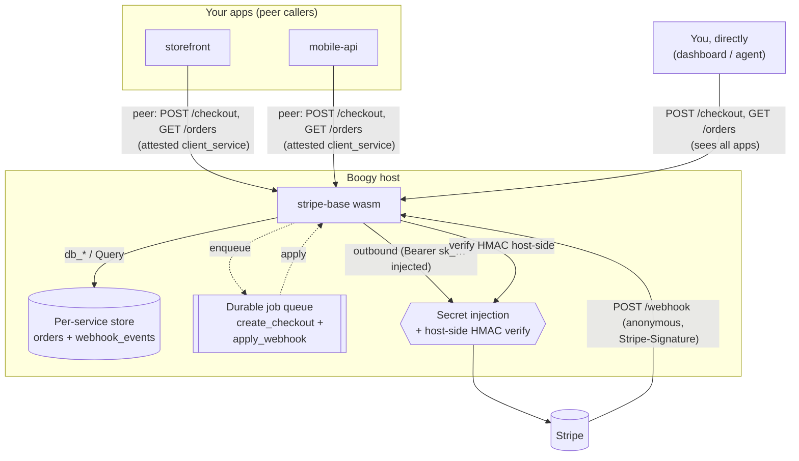
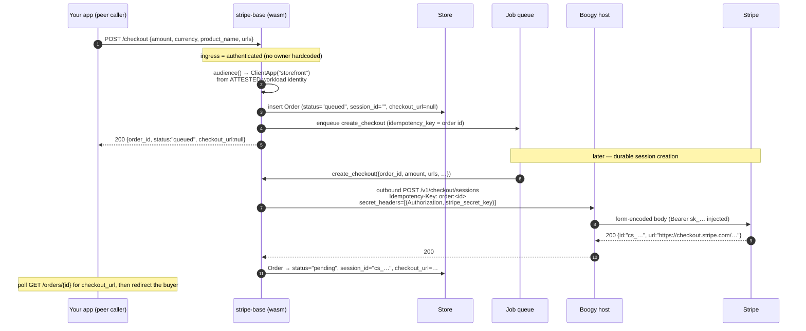
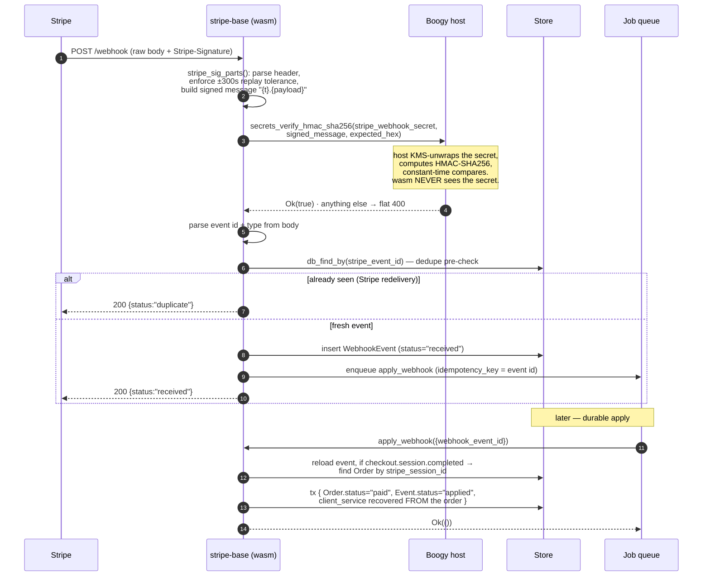
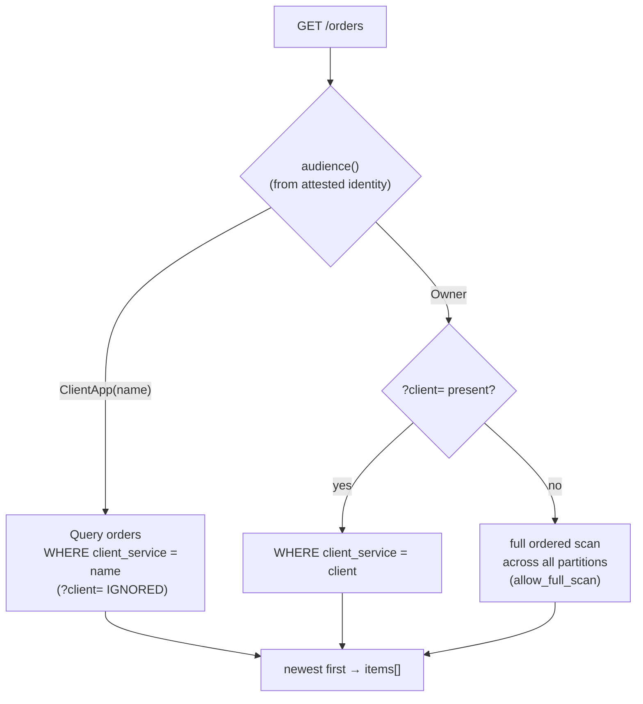
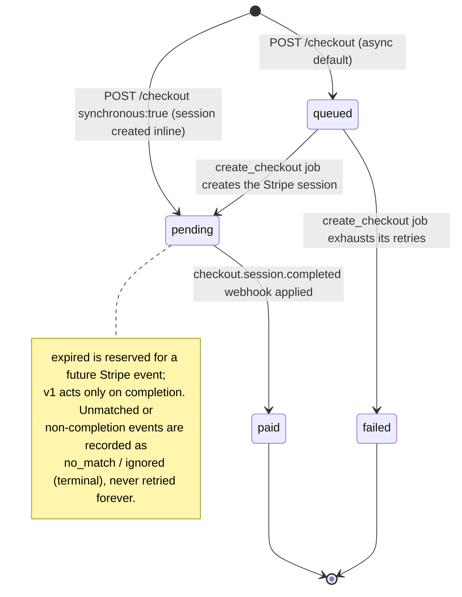

# stripe-base

A **bring-your-own-key** payments service for [Boogy](https://boogy.ai), built as
a wrapper around [Stripe Checkout](https://stripe.com/payments/checkout).

You bind your own Stripe secret key and webhook signing secret (as secrets the
service never reads), and the service gives you:

- a `POST /checkout` endpoint that records a durable **`queued`** order and
  creates the **hosted Stripe Checkout Session** via a transaction-safe durable
  job (so a checkout can be enqueued *inside* a caller's transaction) — or inline
  with `synchronous: true`,
- **signature-verified completion webhooks** (`POST /webhook`) applied durably —
  the order flips to `paid` the moment Stripe confirms payment,
- **per-app order tracking** (`GET /orders`) — one deployment can front *many* of
  your own apps, with each app's orders kept strictly separate.

It is also a canonical example of three advanced Boogy patterns: **host-side HMAC
verification** (the webhook secret never leaves the host), **host-attested
in-handler authorization** (an `authenticated` ingress with NO hardcoded owner;
the handler's `audience()` does the owner-scoping), and **attested multi-tenant
partitioning** (one deployment, many client apps, isolated by host-set workload
identity).

---

## Table of contents

- [The multi-client model (read this first)](#the-multi-client-model)
- [Architecture at a glance](#architecture-at-a-glance)
- [Crate layout](#crate-layout)
- [Data model](#data-model)
- [The API — what you can do](#the-api--what-you-can-do)
- [How it works (sequence diagrams)](#how-it-works)
  - [Creating a checkout](#creating-a-checkout)
  - [The webhook → durable apply](#the-webhook--durable-apply)
  - [Listing orders (the audience split)](#listing-orders-the-audience-split)
- [The order lifecycle](#the-order-lifecycle)
- [Security model](#security-model)
- [Ingress posture](#ingress-posture)
- [Deploying it yourself](#deploying-it-yourself)
- [Worked example](#worked-example)

---

## The multi-client model

This is the one concept to understand before everything else.

**ONE provisioned deployment fronts MANY of your apps.** You deploy `stripe-base`
once, bind your Stripe keys once, and then any number of your *own* apps
(`storefront`, `mobile-api`, `admin`, …) can create checkouts through it. Orders
are partitioned on two axes:

| Axis | Column | Meaning |
|------|--------|---------|
| **Service owner** | `owner_principal` | You — the provisioner who deployed this service. |
| **Which of your apps** | `client_service` | The specific app a payment belongs to. |

The crucial property: `client_service` is **attested, not claimed**. When one of
your apps calls the gateway via a cross-service (`peer`) call, the host stamps
that app's workload identity (`boogy://<you>/services/<app>`) onto the request —
it is host-set and **unspoofable**. The service derives `client_service` from
that identity, *never* from the request body. So:

- A client app sees **only its own** orders. It cannot read another app's orders
  even if it tries — its partition is pinned to its attested identity.
- **You** (the service owner, calling directly e.g. from a dashboard) see **all**
  apps' orders, with an optional `?client=<app>` filter.

This cross-client isolation holds **regardless of ingress** — it's enforced again
in every handler, as defense in depth.

---

## Architecture at a glance



---

## Crate layout

| Path | What it is |
|------|------------|
| [`src/lib.rs`](./src/lib.rs) | The service: router, `/checkout`, `/orders`, `/webhook` handlers, the `audience()` partition resolver, the Stripe outbound call. |
| [`src/models.rs`](./src/models.rs) | The two `#[derive(Model)]` tables — `Order` and `WebhookEvent` — with the partitioning rules documented inline. |
| [`src/jobs.rs`](./src/jobs.rs) | The durable job handlers: `create_checkout` (async session creation, per-order Stripe `Idempotency-Key`, `queued → pending`/`failed`) and `apply_webhook` (verified-event → order state transition, in one transaction). |
| [`stripe-base-core/`](./stripe-base-core) | **Pure, host-testable logic:** checkout form-body shaping, `Stripe-Signature` parsing + replay tolerance, and workload-identity → `client_service` derivation. Extensively unit-tested, including adversarial signature cases. |
| [`boogy.toml`](./boogy.toml) | The manifest: per-route ingress, capabilities, the two secret declarations, the job config. |

---

## Data model

Both tables are typed `#[derive(Model)]` structs; handlers use the `db_*` /
`Query` layer and never touch raw column names.

### `orders` — one per Checkout Session

| Column | Type | Notes |
|--------|------|-------|
| `id` | `u64` (pk) | Store row id. |
| `owner_principal` | string *(indexed)* | The service owner (you). |
| `client_service` | string *(indexed)* | **The partition key** — which of your apps. |
| `stripe_session_id` | string *(lookup_by)* | Natural key; the webhook-apply job resolves the order from this. Empty (`""`) while `queued`; the `create_checkout` job fills it. |
| `amount` / `currency` | i64 / string | Amount in minor units. |
| `status` | string *(indexed)* | `queued` \| `pending` \| `paid` \| `expired` \| `failed`. `queued` = session not yet created (async, job in flight); `pending` = session created, awaiting payment; `failed` = the `create_checkout` job exhausted its retries. |
| `checkout_url` | optional string | The hosted Stripe Checkout URL; `null` while `queued`. Poll `GET /orders/{id}` to pick it up for an async order. |
| `error` | optional string | Last failure detail when `status == "failed"`; `null` otherwise. |
| `metadata` | optional string | Your opaque JSON, stored verbatim. |
| `created_at` / `updated_at` | timestamps | `updated_at` bumps when the job/webhook flips status. |

### `webhook_events` — received Stripe events

| Column | Type | Notes |
|--------|------|-------|
| `id` | `u64` (pk) | Store row id. |
| `stripe_event_id` | string *(lookup_by)* | Dedupe key — a Stripe redelivery is a no-op. |
| `owner_principal` | string *(indexed)* | Service owner. |
| `client_service` | string | Recovered from the matched order in the apply job (the webhook carries no identity). |
| `event_type` | string | e.g. `checkout.session.completed`. |
| `payload` | string | Raw event JSON. |
| `received_at` / `processed_at` | timestamps | |
| `process_status` | string | `received` → `applied` \| `no_match` \| `ignored`. |

---

## The API — what you can do

The service auto-serves an OpenAPI 3.0 document at `GET /openapi.json`. Routes
fall into two groups with very different auth (see [Ingress posture](#ingress-posture)).

### Management routes (your apps / you)

| Method & path | Body | Returns |
|---------------|------|---------|
| `POST /checkout` | `CheckoutReq` (below) | `{ order_id, status, checkout_url? }`. Async default → `status:"queued"`, `checkout_url:null` (poll `GET /orders/{id}`). `synchronous:true` → `status:"pending"` with the `checkout_url` to redirect the buyer to. |
| `GET /orders` | — | `{ items, count }`, newest first. A client app sees only its partition; you see all apps (`?client=<app>` to filter). |
| `GET /orders/{id}` | — | One order, scoped to the caller's partition (`404` if missing **or** outside your partition). |

`CheckoutReq`:

```jsonc
{
  "amount":       2000,            // minor units (e.g. cents)
  "currency":     "usd",
  "product_name": "Pro Plan",
  "success_url":  "https://app.example.com/ok",
  "cancel_url":   "https://app.example.com/cancel",
  "metadata":     { "plan": "pro" },   // optional, opaque, stored verbatim
  "client_ref":   "storefront",        // honored ONLY for a direct owner call with
                                       // no attested workload; ignored for peer callers
  "synchronous":  false                // default false → durable job (tx-safe);
                                       // true → call Stripe inline, return the URL now
}
```

> **Async by default (transaction-safe).** `POST /checkout` records a durable
> `queued` order and enqueues the `create_checkout` job, making **no** outbound
> Stripe call on the request path — so a checkout can be enqueued *inside* a
> caller's `tx` (the queued order + the staged job commit atomically). The job
> creates the session (with a per-order Stripe `Idempotency-Key`, so a retry never
> double-charges) and flips the order to `pending` with the `checkout_url`. Set
> `synchronous: true` to create the session inline and get the URL in the response
> (it falls back to the durable job if the inline call fails).

> `client_ref` exists so *you* (the owner, calling directly) can attribute a
> checkout to a named app. An attested peer caller's `client_service` is derived
> from its host-set identity and **ignores** any `client_ref` — no impersonation.

### Webhook route (Stripe, anonymous)

| Method & path | Auth | Returns |
|---------------|------|---------|
| `POST /webhook` | **HMAC signature**, not identity | `{ status: "received" \| "duplicate", event_id }` |

Stripe holds no Boogy identity, so this route is `public` at the ingress layer and
authenticated **in-handler** by verifying the `Stripe-Signature` HMAC host-side.

---

## How it works

### Creating a checkout

**Async default** — the request path makes no outbound call, so it's
transaction-safe; the durable job creates the session:



With `synchronous: true` the `outbound → Stripe → Order=pending(url)` steps run
inline in the request and the URL is returned directly (falling back to the
durable job if the inline call fails). Either way the **same** per-order
`Idempotency-Key` is used, so an inline call and a later job retry resolve to the
same Stripe session — never a duplicate, never a double charge.

The partition is resolved by `audience()`: an attested workload wins; a direct
owner caller may pass `client_ref`; otherwise the owner sentinel (`_owner/direct`,
collision-proof because it contains `/`, which a real service id never can).

### The webhook → durable apply

This is the heart of the service. The webhook handler does the **fast, safe**
part synchronously and hands the **stateful** part to a durable job.



Why this shape:

- **Verify before anything else.** A forged or stale signature is rejected with a
  flat `400` and never reaches dedupe or enqueue. `Ok(false)` (forged) and `Err`
  (unknown/unavailable secret) are *indistinguishable* to the caller — fail-closed,
  no information leak about which check failed.
- **Verify on the host.** The wasm passes the signed message + the expected hex;
  the host holds the KMS-wrapped secret and does the HMAC + constant-time compare.
  The webhook secret stays out of the wasm and KMS-wrapped at rest.
- **Dedupe.** Stripe retries delivered events. An already-recorded `stripe_event_id`
  returns `200` with no re-insert and no re-enqueue. The apply job's idempotency
  key is a second line of defense against an insert/enqueue race.
- **Return 200 fast; apply durably.** The webhook just records + enqueues. The
  actual order transition runs in `apply_webhook`, retried with backoff if the
  store is briefly unavailable.
- **Recover the partition from the order.** The webhook has no Boogy identity, so
  `client_service` is left empty on the event and recovered from the matched
  `Order` (resolved by Stripe session id) inside the apply job.

> **Transactions vs independent writes.** The webhook handler's insert + enqueue
> are *independent writes* (job-enqueue is denied inside a store transaction). But
> the apply job's two writes — flip the order to `paid` **and** stamp the event
> `applied` — are pure store ops with no external call between them, so they run in
> **one atomic `tx`**. Each value is re-read inside the transaction so a concurrent
> writer can't be clobbered.

### Listing orders (the audience split)



A client app's partition is pinned to its attested identity and any `?client=`
query param is ignored — it can *never* read another app's orders. The owner walks
all partitions (an explicit `allow_full_scan`, since the whole deployment is theirs).

---

## The order lifecycle



The webhook-event side: `received` → `applied` (order flipped) | `no_match`
(no order for that session — terminal, retrying can't conjure one) | `ignored`
(an event type v1 doesn't act on). A *transient* store error leaves the event
`received` and returns `Err(..)`, so the platform retries it honestly.

---

## Security model

- **Two secrets, both invisible to the wasm:**
  - `stripe_secret_key` — `usage = ["outbound-header"]`. Injected verbatim as the
    `Authorization` header on calls to `api.stripe.com`. You bind the full
    `Bearer sk_...` value; the code adds no prefix.
  - `stripe_webhook_secret` — `usage = ["hmac-verify"]`. Never injected anywhere;
    the host uses it to verify the webhook HMAC and returns only a boolean. No
    config row, no `/config` endpoint — it stays KMS-wrapped at rest.
- **Outbound is allow-listed:** `[outbound] allowed_hosts = ["api.stripe.com"]`,
  DNS-pinned and SSRF-firewalled by the host.
- **Replay tolerance:** the `Stripe-Signature` timestamp must be within ±300s of
  the host clock (Stripe's documented default) — rejects both stale and
  clock-skewed-future signatures. The signed message is built from the **raw**
  payload bytes, so a non-UTF-8 body is preserved exactly.
- **Authorization is host-attested, in-handler:** ingress is plain
  `authenticated` (no owner hardcoded); every management handler derives the
  caller's owner from the **attested** identity via `audience()` and rejects a
  different owner's workload / a non-owner agent with `403`. A client app's
  `client_service` is its host-set workload id, never a body field, so it can't
  impersonate another app. `GET /orders/{id}` deny-masks anything outside the
  caller's partition to a `404`, identical to "missing", so a client app can't
  probe for another app's order ids.
- **No double charge on retry:** the durable `create_checkout` job (and the inline
  `synchronous` path) send Stripe a per-order `Idempotency-Key`, so a retried
  session-creation returns the *same* session rather than creating a second one.
- **Untrusted provider output is bounded:** a non-2xx Stripe error body is
  truncated to 512 bytes on a char boundary before it reaches an error string.

---

## Ingress posture

The manifest uses **per-route** ingress. The service-wide default is plain
`mode = "authenticated"` — **no owner is hardcoded** (the module is provisionable
by anyone, so it cannot bake in one owner's id). The webhook is carved out to
`public`:

```toml
[ingress]
# Any authenticated principal passes ingress; the handler's audience() does the
# owner-scoping, host-attested. NO allowed_origins / allowed_agents allowlist.
mode = "authenticated"

# the anonymous Stripe callback (authenticated by HMAC in-handler):
[[ingress.routes]]
path = "/webhook"
mode = "public"
```

Cross-owner authorization is **not** an ingress allowlist; it lives in the
handler's `audience()`, which derives the caller's owner from the **attested**
identity and compares it to the service owner — no hardcoded id, correct for
*every* provisioner:

| Caller | `audience()` | Sees |
|--------|-------------|------|
| One of **your** apps (attested `boogy://<you>/services/<app>`) | `ClientApp(app)` | only that app's partition |
| **You** (your agent, attested by `caller_is_service_owner`) | `Owner` | all your apps (`?client=` to filter) |
| A **different** owner's workload, a non-owner agent, or anon | `Denied` | `403` |

So `POST /checkout`, `GET /orders`, `GET /orders/{id}` are reachable by any
authenticated caller but **scoped** in-handler: a different owner's workload can
never read or create in your deployment. The most-specific route match wins, so
`/webhook` overrides the default to `public`. There is nothing to replace when you
deploy — the owner is your deploying principal.

---

## Deploying it yourself

1. **Build** the wasm component:

   ```bash
   cargo build -p stripe-base --target wasm32-wasip2 --release
   ```

   > This service uses the SDK's host-side HMAC-verify capability for webhooks. If
   > your pinned SDK revision predates it, pin a newer one.

2. **Provision** from `boogy.toml` (per-route ingress, capabilities `store` /
   `auth` / `clock` / `entropy` / `outbound_http` / `background_jobs`, the two
   secret declarations, the `apply_webhook` job).

3. **Bind your two Stripe secrets** out-of-band via the admin secrets endpoint:

   ```bash
   # the secret key — bind the FULL Authorization header value:
   printf 'Bearer sk_live_...' | \
     boogy secret set <owner>/stripe-base/stripe_secret_key --stdin

   # the webhook signing secret — the raw whsec_... value:
   printf 'whsec_...' | \
     boogy secret set <owner>/stripe-base/stripe_webhook_secret --stdin
   ```

4. **Point a Stripe webhook** at `https://<handle>.<base>/<service>/webhook` for the
   `checkout.session.completed` event.

5. **Create checkouts** — from your apps (peer call) or directly (owner).

---

## Worked example

```bash
# 1. Create a checkout (async default; as the owner — a peer app omits client_ref)
curl -X POST https://<handle>.<base>/<service>/checkout \
  -H "authorization: Bearer <token>" -H 'content-type: application/json' \
  -d '{"amount":2000,"currency":"usd","product_name":"Pro Plan",
       "success_url":"https://app/ok","cancel_url":"https://app/cancel",
       "client_ref":"storefront"}'
# → 200 {"order_id":42,"status":"queued","checkout_url":null}
#    (the durable create_checkout job creates the Stripe session next)
#    Need the URL synchronously instead? add "synchronous": true and the response
#    is {"order_id":42,"status":"pending","checkout_url":"https://checkout.stripe.com/…"}.

# 2. Poll the order until the job has created the session (status → "pending").
curl "https://<handle>.<base>/<service>/orders/42" -H "authorization: Bearer <token>"
# → {"id":42,"status":"pending","checkout_url":"https://checkout.stripe.com/c/pay/cs_…",...}
# redirect the buyer to checkout_url

# 3. Stripe later calls POST /webhook with checkout.session.completed.
#    The service verifies the signature, records + dedupes the event, and the
#    durable apply job flips order 42 to "paid".

# 4. Check the order (owner sees all apps; ?client= to filter)
curl "https://<handle>.<base>/<service>/orders?client=storefront" \
  -H "authorization: Bearer <token>"
# → {"items":[{"id":42,"client_service":"storefront","status":"paid",...}],"count":1}
```

---

*Part of the [Boogy catalog](../README.md). See the SDK's `AGENTS.md` for the
canonical handler-authoring conventions these services follow.*
